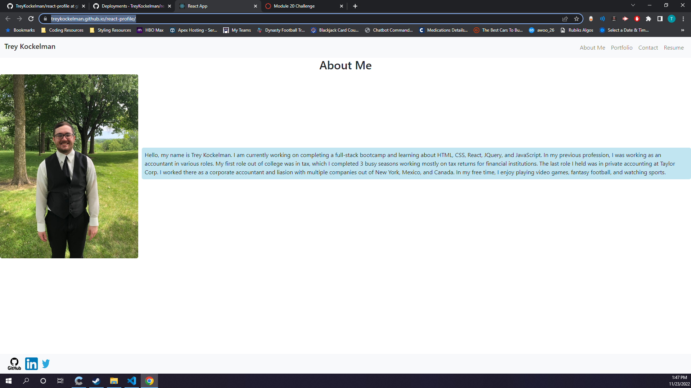

# React Profile - Trey Kockelman

  
  ## Description
  The purpose of this project is to create a profile with React to display my skills learned thus far as a developer. There were some struggles with this project as it was my first project with React. I could not get the form to validate but everything else went smoothly just took a bit of time to finish.

  ## Table of Contents
  - [Usage](#usage)
  - [Contributors](#contributors)
  - [Questions](#questions)

  ## Usage
  The intended use of this portfolio is to display the work I have done so far.

  ## Deployed Website
  [Portfolio](https://treykockelman.github.io/react-profile/)

  ## Screenshot
  

  ## Contributors
  Trey Kockelman

  ## Questions
  If you have any questions feel free to go to my github account [TreyKockelman](https://github.com/TreyKockelman) or email me at [kockelmant@gmail.com](kockelmant@gmail.com).